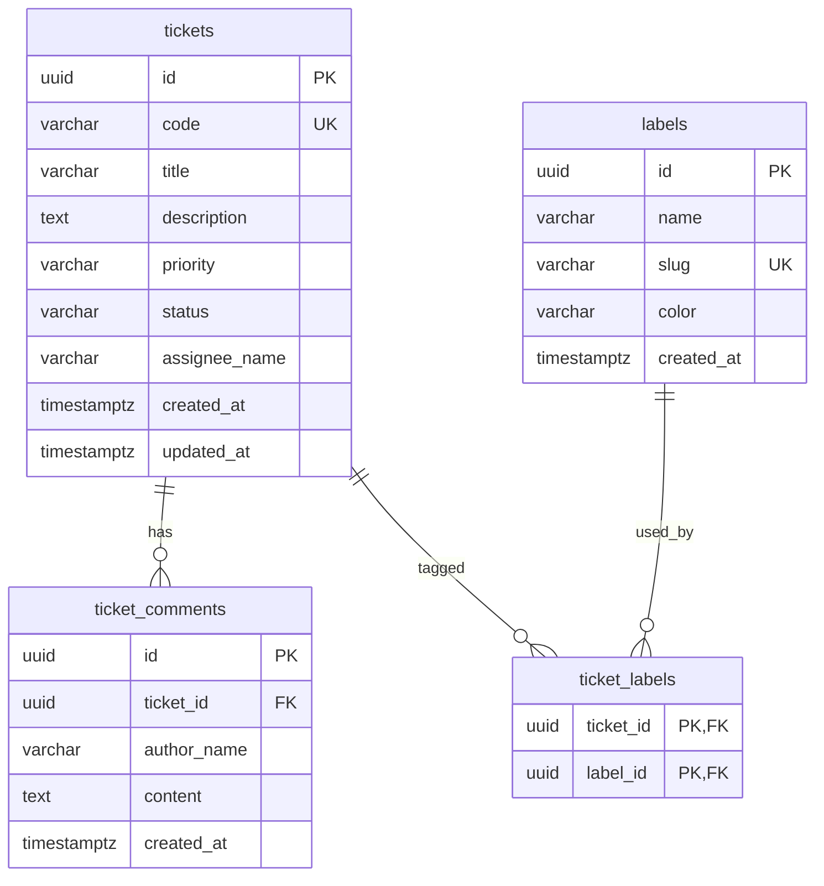

# Mini 1 — Helpdesk Ticket API

## 1. Mục tiêu và vai trò của project

`Mini01.Helpdesk` là một REST API độc lập để quản lý các yêu cầu hỗ trợ nội bộ của một công ty nhỏ. Ví dụ: nhân viên không đăng nhập được, máy in bị lỗi hoặc cần cấp quyền vào một hệ thống.

Project này dùng để học trọn một luồng backend cơ bản nhưng thực tế:

```text
Swagger request
    -> Controller nhận và kiểm tra request
    -> Service xử lý luật nghiệp vụ
    -> EF Core đọc/ghi PostgreSQL
    -> Controller trả HTTP status + JSON response
```

Sau khi hoàn thành, người học cần hiểu được:

- Thiết kế entity và quan hệ một-nhiều, nhiều-nhiều.
- Tạo migration và bảo vệ dữ liệu bằng PK, FK, UNIQUE, CHECK.
- Viết CRUD, filter kết hợp, phân trang và sắp xếp ổn định.
- Sinh ticket code an toàn khi có nhiều request đồng thời.
- Chống hai người ghi đè thay đổi của nhau bằng optimistic concurrency.
- Phân biệt request model, entity và response model.
- Trả mã HTTP và error response nhất quán.
- Mở Swagger, gọi API và kiểm tra một demo flow từ đầu đến cuối.

Đây **không phải** module thêm vào project `document_first` hiện tại. Nó nên là một solution độc lập, có database và migration riêng. Source hiện tại chỉ là tài liệu tham khảo cho cách tổ chức code.

## 2. Phạm vi

### 2.1. Có làm

- CRUD ticket.
- Lọc và phân trang danh sách ticket.
- Thêm comment vào ticket.
- Tạo, xem và gắn label cho ticket.
- Database constraint.
- Optimistic concurrency khi cập nhật ticket.
- Error response thống nhất.
- Swagger để chạy và test API bằng tay.
- Có thể thêm integration test sau khi demo Swagger đã chạy.

### 2.2. Không làm

- Đăng ký, đăng nhập, JWT và phân quyền.
- Upload file hoặc attachment.
- Email, notification hoặc background worker.
- Lịch sử phiên bản, audit log đầy đủ hoặc soft delete.
- Docker, Kubernetes, CI/CD, cloud hoặc deploy.
- Frontend.

Các tên `assigneeName`, `authorName` chỉ là chuỗi. Mini 1 chưa có bảng user và không phụ thuộc một project auth khác.

## 3. Công nghệ và cấu trúc đề xuất

### 3.1. Công nghệ

| Thành phần | Lựa chọn | Vai trò |
|---|---|---|
| Runtime | .NET 8 SDK | Chạy ASP.NET Core Web API. |
| API | ASP.NET Core Controllers | Khai báo route, request và HTTP response. |
| ORM | Entity Framework Core 8 | Mapping entity, query và migration. |
| Database | PostgreSQL cài trực tiếp trên máy | Lưu dữ liệu và thực thi constraint. |
| Driver | Npgsql EF Core provider | Kết nối EF Core với PostgreSQL. |
| API UI | Swashbuckle | Sinh OpenAPI và Swagger UI. |

Không cần Redis, MediatR, AutoMapper, FluentValidation hay repository generic cho bài này. Validation bằng Data Annotations kết hợp kiểm tra trong service là đủ. Chỉ thêm abstraction khi có nhu cầu thật.

### 3.2. Cấu trúc solution

Nên dùng ba project nhỏ để trách nhiệm rõ ràng mà vẫn dễ theo dõi:

```text
Mini01.Helpdesk/
├── src/
│   ├── Mini01.Helpdesk.Api/
│   │   ├── Controllers/
│   │   ├── Middleware/
│   │   ├── Models/
│   │   ├── Program.cs
│   │   └── appsettings.json
│   ├── Mini01.Helpdesk.Application/
│   │   ├── Common/
│   │   ├── Labels/
│   │   └── Tickets/
│   └── Mini01.Helpdesk.Data/
│       ├── Configurations/
│       ├── Entities/
│       ├── Migrations/
│       └── HelpdeskDbContext.cs
└── Mini01.Helpdesk.sln
```

Quan hệ tham chiếu:

```text
Api -> Application -> Data
Api ----------------> Data    (để đăng ký DbContext và chạy migration)
```

Nếu đây là project .NET đầu tiên, có thể đặt cả Controller, Service, Entity và DbContext trong một Web API project. Hợp đồng API và database trong tài liệu này không thay đổi.

## 4. Setup local, không dùng Docker

### 4.1. Cần cài trên máy

1. .NET 8 SDK.
2. PostgreSQL 16 hoặc bản tương thích với Npgsql 8.
3. Một công cụ quản lý database tùy chọn như pgAdmin hoặc DBeaver.
4. IDE: Visual Studio, Rider hoặc VS Code/Cursor với C# extension.

Kiểm tra .NET:

```powershell
dotnet --version
```

Kiểm tra PostgreSQL nếu `psql` đã có trong `PATH`:

```powershell
psql --version
```

### 4.2. Tạo solution

Chạy tại thư mục muốn chứa mini-project:

```powershell
mkdir Mini01.Helpdesk
cd Mini01.Helpdesk
dotnet new sln -n Mini01.Helpdesk
dotnet new webapi -n Mini01.Helpdesk.Api -o src/Mini01.Helpdesk.Api --use-controllers
dotnet new classlib -n Mini01.Helpdesk.Application -o src/Mini01.Helpdesk.Application
dotnet new classlib -n Mini01.Helpdesk.Data -o src/Mini01.Helpdesk.Data
dotnet sln add src/Mini01.Helpdesk.Api/Mini01.Helpdesk.Api.csproj
dotnet sln add src/Mini01.Helpdesk.Application/Mini01.Helpdesk.Application.csproj
dotnet sln add src/Mini01.Helpdesk.Data/Mini01.Helpdesk.Data.csproj
dotnet add src/Mini01.Helpdesk.Api reference src/Mini01.Helpdesk.Application
dotnet add src/Mini01.Helpdesk.Api reference src/Mini01.Helpdesk.Data
dotnet add src/Mini01.Helpdesk.Application reference src/Mini01.Helpdesk.Data
```

Xóa `WeatherForecast.cs` và `WeatherForecastController.cs` vì chúng chỉ là code mẫu của template.

### 4.3. Package cần cài

Các version dưới đây bám theo repository `document_first` hiện tại và phù hợp với .NET 8:

```powershell
dotnet add src/Mini01.Helpdesk.Data package Microsoft.EntityFrameworkCore --version 8.0.29
dotnet add src/Mini01.Helpdesk.Data package Microsoft.EntityFrameworkCore.Design --version 8.0.29
dotnet add src/Mini01.Helpdesk.Data package Npgsql.EntityFrameworkCore.PostgreSQL --version 8.0.11
dotnet add src/Mini01.Helpdesk.Data package EFCore.NamingConventions --version 8.0.3
dotnet add src/Mini01.Helpdesk.Api package Microsoft.EntityFrameworkCore.Design --version 8.0.29
dotnet add src/Mini01.Helpdesk.Api package Npgsql.EntityFrameworkCore.PostgreSQL --version 8.0.11
dotnet add src/Mini01.Helpdesk.Api package Swashbuckle.AspNetCore --version 7.3.2
dotnet tool install --global dotnet-ef --version 8.0.29
```

Trách nhiệm package:

| Package | Bắt buộc | Lý do |
|---|---:|---|
| `Microsoft.EntityFrameworkCore` | Có | DbContext, LINQ và change tracking. |
| `Microsoft.EntityFrameworkCore.Design` | Có | Sinh và chạy migration. |
| `Npgsql.EntityFrameworkCore.PostgreSQL` | Có | EF Core provider cho PostgreSQL. |
| `EFCore.NamingConventions` | Nên có | Tự đổi tên C# sang `snake_case` trong PostgreSQL. |
| `Swashbuckle.AspNetCore` | Có | Swagger/OpenAPI. |

Không cần cài package validation hoặc mapping cho MVP.

### 4.4. Tạo database local

Có thể tạo bằng pgAdmin hoặc câu lệnh:

```sql
CREATE DATABASE mini01_helpdesk;
```

Tạo `src/Mini01.Helpdesk.Api/appsettings.json`:

```json
{
  "ConnectionStrings": {
    "DefaultConnection": "Host=localhost;Port=5432;Database=mini01_helpdesk;Username=postgres;Password=YOUR_PASSWORD"
  },
  "Logging": {
    "LogLevel": {
      "Default": "Information",
      "Microsoft.AspNetCore": "Warning"
    }
  },
  "AllowedHosts": "*"
}
```

Không commit mật khẩu thật. Nếu repository được chia sẻ, chuyển connection string sang user secrets:

```powershell
cd src/Mini01.Helpdesk.Api
dotnet user-secrets init
dotnet user-secrets set "ConnectionStrings:DefaultConnection" "Host=localhost;Port=5432;Database=mini01_helpdesk;Username=postgres;Password=YOUR_PASSWORD"
```

### 4.5. Đăng ký service trong `Program.cs`

Luồng cấu hình tối thiểu:

```csharp
builder.Services.AddControllers();
builder.Services.AddEndpointsApiExplorer();
builder.Services.AddSwaggerGen();

builder.Services.AddDbContext<HelpdeskDbContext>(options =>
    options
        .UseNpgsql(builder.Configuration.GetConnectionString("DefaultConnection"))
        .UseSnakeCaseNamingConvention());

builder.Services.AddScoped<ITicketService, TicketService>();
builder.Services.AddScoped<ILabelService, LabelService>();
builder.Services.AddTransient<GlobalExceptionHandlerMiddleware>();
```

Pipeline tối thiểu:

```csharp
var app = builder.Build();

app.UseMiddleware<GlobalExceptionHandlerMiddleware>();

if (app.Environment.IsDevelopment())
{
    app.UseSwagger();
    app.UseSwaggerUI();
}

app.MapControllers();
app.MapGet("/", () => Results.Redirect("/swagger/index.html"));
app.Run();
```

Không thêm `UseAuthentication()` hoặc `UseAuthorization()` trong Mini 1.

## 5. Database design

Database có đúng bốn table nghiệp vụ và một PostgreSQL sequence hỗ trợ sinh code:



### 5.1. Enum nghiệp vụ

Nên lưu enum thành chuỗi để đọc dữ liệu và response Swagger dễ hiểu.

`TicketPriority`:

| Giá trị | Ý nghĩa |
|---|---|
| `Low` | Không gấp. |
| `Medium` | Mức mặc định. |
| `High` | Cần ưu tiên xử lý. |
| `Urgent` | Ảnh hưởng nghiêm trọng. |

`TicketStatus`:

| Giá trị | Ý nghĩa |
|---|---|
| `Open` | Vừa tạo, chưa xử lý. |
| `InProgress` | Đang xử lý. |
| `Resolved` | Đã có cách giải quyết, chờ xác nhận. |
| `Closed` | Đã đóng; không nhận comment mới. |

### 5.2. Table `tickets`

| Field | PostgreSQL type | Null | Default | Constraint/ý nghĩa |
|---|---|---:|---|---|
| `id` | `uuid` | Không | Application sinh Guid | Primary key. |
| `code` | `varchar(20)` | Không | Lấy số từ sequence | Unique, dạng `TCK-0001`. Client không gửi. |
| `title` | `varchar(200)` | Không |  | Trim; không được rỗng. |
| `description` | `text` | Không |  | Trim; không được rỗng. |
| `priority` | `varchar(20)` | Không | `Medium` | Chỉ `Low`, `Medium`, `High`, `Urgent`. |
| `status` | `varchar(20)` | Không | `Open` | Chỉ `Open`, `InProgress`, `Resolved`, `Closed`. |
| `assignee_name` | `varchar(150)` | Có | `NULL` | Tên người phụ trách; Mini 1 chưa có user. |
| `created_at` | `timestamptz` | Không | Application dùng UTC | Thời điểm tạo. |
| `updated_at` | `timestamptz` | Có | `NULL` | Thời điểm cập nhật gần nhất. |
| `xmin` | PostgreSQL system column `xid` | Không | PostgreSQL quản lý | Map ra API thành `rowVersion`; không tạo cột trong migration. |

Index và constraint:

- PK: `pk_tickets (id)`.
- UNIQUE: `ux_tickets_code (code)`.
- CHECK: `ck_tickets_title_not_blank`.
- CHECK: `ck_tickets_description_not_blank`.
- CHECK: `ck_tickets_priority_valid`.
- CHECK: `ck_tickets_status_valid`.
- Index phục vụ list: `ix_tickets_created_at_id (created_at DESC, id DESC)`.
- Index filter: `ix_tickets_status_priority (status, priority)`.
- Index assignee: `ix_tickets_assignee_name (assignee_name)`.

`rowVersion` không phải số version nghiệp vụ. Nó chỉ cho biết hàng đã bị thay đổi hay chưa. Mapping theo cách repository hiện tại đang dùng:

```csharp
builder.Property<uint>("xmin")
    .IsRowVersion()
    .HasColumnName("xmin")
    .HasColumnType("xid");
```

Khi query response, lấy giá trị bằng `EF.Property<uint>(ticket, "xmin")`. Khi update, service so `request.RowVersion` với giá trị hiện tại; EF tiếp tục kiểm tra lại lúc `SaveChangesAsync` để đóng race condition.

### 5.3. Table `ticket_comments`

| Field | PostgreSQL type | Null | Constraint/ý nghĩa |
|---|---|---:|---|
| `id` | `uuid` | Không | Primary key. |
| `ticket_id` | `uuid` | Không | FK đến `tickets.id`, `ON DELETE CASCADE`. |
| `author_name` | `varchar(150)` | Không | Trim; không được rỗng. |
| `content` | `text` | Không | Trim; không được rỗng. |
| `created_at` | `timestamptz` | Không | UTC, comment không sửa trong MVP. |

Index và constraint:

- `ix_ticket_comments_ticket_id_created_at (ticket_id, created_at, id)` để đọc comment đúng thứ tự.
- `ck_ticket_comments_author_not_blank`.
- `ck_ticket_comments_content_not_blank`.

Xóa ticket sẽ xóa comment của ticket. Không có endpoint xóa comment trong MVP.

### 5.4. Table `labels`

| Field | PostgreSQL type | Null | Constraint/ý nghĩa |
|---|---|---:|---|
| `id` | `uuid` | Không | Primary key. |
| `name` | `varchar(100)` | Không | Tên hiển thị, không rỗng. |
| `slug` | `varchar(100)` | Không | Unique, chữ thường và dấu gạch ngang, ví dụ `hardware`. |
| `color` | `varchar(7)` | Không | Hex color dạng `#RRGGBB`. |
| `created_at` | `timestamptz` | Không | UTC. |

Index và constraint:

- UNIQUE: `ux_labels_slug (slug)`.
- CHECK: `ck_labels_name_not_blank`.
- CHECK: `ck_labels_slug_format`, regex đề xuất `^[a-z0-9]+(?:-[a-z0-9]+)*$`.
- CHECK: `ck_labels_color_hex`, regex đề xuất `^#[0-9A-Fa-f]{6}$`.

Service nên tự tạo slug từ name nếu request không gửi slug: trim, chuyển chữ thường, đổi khoảng trắng thành `-` và bỏ ký tự không hợp lệ.

### 5.5. Table `ticket_labels`

| Field | PostgreSQL type | Null | Constraint/ý nghĩa |
|---|---|---:|---|
| `ticket_id` | `uuid` | Không | FK đến `tickets.id`, `ON DELETE CASCADE`. |
| `label_id` | `uuid` | Không | FK đến `labels.id`, `ON DELETE CASCADE`. |

Primary key là `(ticket_id, label_id)`. Nhờ composite PK, một label không thể bị gắn hai lần vào cùng ticket.

### 5.6. PostgreSQL sequence sinh ticket code

Tạo sequence trong migration:

```sql
CREATE SEQUENCE ticket_code_seq START WITH 1 INCREMENT BY 1;
```

Khi tạo ticket, lấy số bằng một câu SQL:

```sql
SELECT nextval('ticket_code_seq');
```

Sau đó format tại application:

```csharp
$"TCK-{number:D4}"
```

`nextval` là atomic nên hai request đồng thời không nhận cùng số. Sequence có thể có khoảng trống nếu transaction rollback; đây là hành vi đúng. Ticket code cần duy nhất và tăng dần, không cần liên tục tuyệt đối.

### 5.7. Migration

Sau khi tạo entity, configuration và DbContext:

```powershell
dotnet ef migrations add InitialHelpdeskSchema --project src/Mini01.Helpdesk.Data --startup-project src/Mini01.Helpdesk.Api
dotnet ef database update --project src/Mini01.Helpdesk.Data --startup-project src/Mini01.Helpdesk.Api
```

Thêm `CREATE SEQUENCE` vào `Up()` và `DROP SEQUENCE` vào `Down()` của migration bằng `migrationBuilder.Sql(...)`.

Không dùng `Database.EnsureCreated()`: nó bỏ qua lịch sử migration và phần SQL sequence viết tay.

## 6. Quy tắc nghiệp vụ

1. `code` do server sinh, client không được chọn hoặc sửa.
2. Ticket mới luôn có status `Open`.
3. `title` và `description` phải được trim và không được rỗng.
4. `page` bắt đầu từ 1; `pageSize` mặc định 20, nhỏ nhất 1 và lớn nhất 100.
5. Filter được kết hợp bằng AND. Ví dụ status `Open` + priority `High` chỉ trả ticket thỏa cả hai.
6. `q` tìm không phân biệt hoa thường trong `code`, `title` và `description` bằng `EF.Functions.ILike`.
7. Danh sách sort mặc định `createdAt DESC`, sau đó `id DESC` để ổn định khi hai hàng cùng thời gian.
8. Ticket `Closed` không nhận comment mới; trả `409 Conflict` với code `TICKET_CLOSED`.
9. Update bắt buộc gửi `rowVersion` lấy từ lần GET gần nhất.
10. Nếu `rowVersion` cũ, trả `409 Conflict` với code `TICKET_CONCURRENCY_CONFLICT`.
11. `PUT /labels` là replace toàn bộ: danh sách gửi lên là trạng thái label cuối cùng của ticket.
12. Mọi `labelId` phải tồn tại. Chỉ cần một ID sai thì không thay đổi gì và trả `400`.
13. Label ID trùng trong request là request không hợp lệ; DB composite PK là lớp bảo vệ cuối.
14. Xóa ticket là hard delete trong Mini 1; comments và ticket-label rows bị cascade delete.
15. `GET` không tìm thấy trả `404`; `DELETE` không tìm thấy cũng trả `404` để phát hiện ID sai.

## 7. Quy ước response và error

### 7.1. Success response một đối tượng

```json
{
  "isSuccess": true,
  "isFailed": false,
  "value": {},
  "error": null,
  "traceId": "0HN...",
  "timestampUtc": "2026-08-01T08:30:00Z"
}
```

### 7.2. Success response phân trang

```json
{
  "isSuccess": true,
  "isFailed": false,
  "value": {
    "items": [],
    "page": 1,
    "pageSize": 20,
    "totalCount": 0,
    "totalPages": 0,
    "hasNextPage": false,
    "hasPreviousPage": false
  },
  "error": null,
  "traceId": "0HN...",
  "timestampUtc": "2026-08-01T08:30:00Z"
}
```

### 7.3. Error response

```json
{
  "title": "Conflict",
  "status": 409,
  "detail": "Ticket đã được cập nhật bởi một request khác. Hãy tải lại dữ liệu.",
  "messageCode": "TICKET_CONCURRENCY_CONFLICT",
  "errors": null,
  "traceId": "0HN...",
  "timestampUtc": "2026-08-01T08:31:00Z"
}
```

Các `messageCode` nên có:

| HTTP | `messageCode` | Khi nào dùng |
|---:|---|---|
| 400 | `VALIDATION_FAILED` | Data Annotation hoặc request nghiệp vụ sai. |
| 400 | `LABEL_IDS_INVALID` | Có label ID không tồn tại hoặc ID bị lặp. |
| 404 | `TICKET_NOT_FOUND` | Không tìm thấy ticket. |
| 404 | `LABEL_NOT_FOUND` | Không tìm thấy label. |
| 409 | `TICKET_CLOSED` | Thêm comment vào ticket đã đóng. |
| 409 | `TICKET_CONCURRENCY_CONFLICT` | `rowVersion` đã cũ. |
| 409 | `LABEL_SLUG_DUPLICATED` | Slug label đã tồn tại. |
| 500 | `UNEXPECTED_ERROR` | Lỗi ngoài dự kiến; không trả stack trace cho client. |

## 8. API contract

Base URL khi chạy local được lấy từ `launchSettings.json`, ví dụ:

```text
http://localhost:5095
```

Route dùng prefix `/api` để phân biệt endpoint nghiệp vụ.

| Method | Endpoint | Vai trò | Thành công |
|---|---|---|---|
| `POST` | `/api/tickets` | Tạo ticket. | `201 Created` + ticket detail. |
| `GET` | `/api/tickets` | Filter và phân trang. | `200 OK` + paged response. |
| `GET` | `/api/tickets/{id}` | Xem ticket, comments và labels. | `200 OK` + ticket detail. |
| `PUT` | `/api/tickets/{id}` | Cập nhật có concurrency check. | `200 OK` + ticket detail mới. |
| `DELETE` | `/api/tickets/{id}` | Xóa ticket. | `204 No Content`. |
| `POST` | `/api/tickets/{id}/comments` | Thêm comment. | `201 Created` + comment. |
| `PUT` | `/api/tickets/{id}/labels` | Thay toàn bộ labels của ticket. | `200 OK` + labels hiện tại. |
| `GET` | `/api/labels` | Lấy label để chọn trên Swagger. | `200 OK` + danh sách label. |
| `POST` | `/api/labels` | Tạo label phục vụ demo. | `201 Created` + label. |

### 8.1. `POST /api/tickets` — tạo ticket

Request:

```json
{
  "title": "Không đăng nhập được VPN",
  "description": "VPN báo sai mật khẩu dù tài khoản vẫn đăng nhập email được.",
  "priority": "High",
  "assigneeName": "Nguyễn An"
}
```

Field:

| Field | Type | Bắt buộc | Validation |
|---|---|---:|---|
| `title` | string | Có | 1–200 ký tự sau trim. |
| `description` | string | Có | Không rỗng, tối đa đề xuất 10.000 ký tự. |
| `priority` | enum string | Có | `Low`, `Medium`, `High`, `Urgent`. |
| `assigneeName` | string/null | Không | Tối đa 150 ký tự. |

Response `201 Created`, có header `Location: /api/tickets/{id}`:

```json
{
  "isSuccess": true,
  "isFailed": false,
  "value": {
    "id": "31bf2a62-e77f-4b86-826f-63b4541dc714",
    "code": "TCK-0001",
    "title": "Không đăng nhập được VPN",
    "description": "VPN báo sai mật khẩu dù tài khoản vẫn đăng nhập email được.",
    "priority": "High",
    "status": "Open",
    "assigneeName": "Nguyễn An",
    "rowVersion": 751,
    "createdAt": "2026-08-01T08:30:00Z",
    "updatedAt": null,
    "comments": [],
    "labels": []
  },
  "error": null,
  "traceId": "0HN...",
  "timestampUtc": "2026-08-01T08:30:00Z"
}
```

Lỗi: `400 VALIDATION_FAILED`.

### 8.2. `GET /api/tickets` — filter và phân trang

Query parameters:

| Parameter | Type | Default | Ý nghĩa |
|---|---|---|---|
| `status` | enum/null | null | Lọc chính xác theo status. |
| `priority` | enum/null | null | Lọc chính xác theo priority. |
| `assignee` | string/null | null | Tìm assignee không phân biệt hoa thường. |
| `q` | string/null | null | Tìm trong code, title, description. |
| `labelId` | uuid/null | null | Tùy chọn nhưng hữu ích: lọc ticket có label. |
| `page` | int | 1 | Trang bắt đầu từ 1. |
| `pageSize` | int | 20 | Từ 1 đến 100. |

Ví dụ:

```text
GET /api/tickets?status=Open&priority=High&q=vpn&page=1&pageSize=20
```

Response `200 OK` chỉ dùng projection nhẹ, không trả `description`, comments hoặc toàn bộ navigation:

```json
{
  "isSuccess": true,
  "isFailed": false,
  "value": {
    "items": [
      {
        "id": "31bf2a62-e77f-4b86-826f-63b4541dc714",
        "code": "TCK-0001",
        "title": "Không đăng nhập được VPN",
        "priority": "High",
        "status": "Open",
        "assigneeName": "Nguyễn An",
        "commentCount": 0,
        "labels": [],
        "rowVersion": 751,
        "createdAt": "2026-08-01T08:30:00Z",
        "updatedAt": null
      }
    ],
    "page": 1,
    "pageSize": 20,
    "totalCount": 1,
    "totalPages": 1,
    "hasNextPage": false,
    "hasPreviousPage": false
  },
  "error": null,
  "traceId": "0HN...",
  "timestampUtc": "2026-08-01T08:32:00Z"
}
```

Lỗi: `400 VALIDATION_FAILED` khi enum, page hoặc pageSize sai.

Query cần thực hiện theo thứ tự logic:

```text
AsNoTracking
-> áp dụng từng filter có giá trị
-> CountAsync
-> OrderByDescending(created_at).ThenByDescending(id)
-> Skip((page - 1) * pageSize).Take(pageSize)
-> Select thẳng sang TicketListItemResponse
```

Không gọi `Include(x => x.Comments)` chỉ để đếm; dùng `x.Comments.Count()` trong projection để database thực hiện `COUNT`.

### 8.3. `GET /api/tickets/{id}` — xem chi tiết

Request không có body.

Response `200 OK`: cùng cấu trúc ticket detail ở response tạo mới, trong đó:

- `comments` sort `createdAt ASC`, rồi `id ASC`.
- `labels` sort `name ASC`, rồi `id ASC`.
- Có `rowVersion` mới nhất để dùng cho update.

Lỗi: `404 TICKET_NOT_FOUND`.

### 8.4. `PUT /api/tickets/{id}` — cập nhật ticket

`PUT` nhận toàn bộ các field có thể sửa. Không cho sửa `id`, `code` hoặc `createdAt`.

Request:

```json
{
  "title": "Không đăng nhập được VPN công ty",
  "description": "Đã reset mật khẩu nhưng VPN vẫn báo lỗi.",
  "priority": "Urgent",
  "status": "InProgress",
  "assigneeName": "Nguyễn An",
  "rowVersion": 751
}
```

| Field | Type | Bắt buộc | Validation |
|---|---|---:|---|
| `title` | string | Có | 1–200 ký tự. |
| `description` | string | Có | Không rỗng. |
| `priority` | enum string | Có | Giá trị hợp lệ. |
| `status` | enum string | Có | Giá trị hợp lệ. |
| `assigneeName` | string/null | Không | Tối đa 150 ký tự. |
| `rowVersion` | uint | Có | Giá trị từ response GET/POST gần nhất. |

Response `200 OK`: ticket detail và `rowVersion` mới.

Lỗi:

- `400 VALIDATION_FAILED` nếu request sai.
- `404 TICKET_NOT_FOUND` nếu ID không tồn tại.
- `409 TICKET_CONCURRENCY_CONFLICT` nếu row version đã cũ.

Không dùng HTTP `ETag` trong MVP; đưa `rowVersion` trong JSON dễ test bằng Swagger hơn.

### 8.5. `DELETE /api/tickets/{id}` — xóa ticket

Request không có body.

Response thành công: `204 No Content`, không có JSON body.

Database tự cascade xóa `ticket_comments` và `ticket_labels`. Label vẫn còn vì có thể được dùng bởi ticket khác.

Lỗi: `404 TICKET_NOT_FOUND`.

### 8.6. `POST /api/tickets/{id}/comments` — thêm comment

Request:

```json
{
  "authorName": "Trần Bình",
  "content": "Đã kiểm tra tài khoản, đang thử cấp lại VPN profile."
}
```

| Field | Type | Bắt buộc | Validation |
|---|---|---:|---|
| `authorName` | string | Có | 1–150 ký tự. |
| `content` | string | Có | Không rỗng, tối đa đề xuất 5.000 ký tự. |

Response `201 Created`:

```json
{
  "isSuccess": true,
  "isFailed": false,
  "value": {
    "id": "7365328c-8381-44a9-8174-7c572a5509f1",
    "ticketId": "31bf2a62-e77f-4b86-826f-63b4541dc714",
    "authorName": "Trần Bình",
    "content": "Đã kiểm tra tài khoản, đang thử cấp lại VPN profile.",
    "createdAt": "2026-08-01T08:40:00Z"
  },
  "error": null,
  "traceId": "0HN...",
  "timestampUtc": "2026-08-01T08:40:00Z"
}
```

Lỗi:

- `400 VALIDATION_FAILED`.
- `404 TICKET_NOT_FOUND`.
- `409 TICKET_CLOSED`.

### 8.7. `PUT /api/tickets/{id}/labels` — thay toàn bộ label của ticket

Request:

```json
{
  "labelIds": [
    "4371a09e-2ef9-4635-8521-32237030e6db",
    "1c089fbd-7ce1-41cd-8429-5863f56bb38b"
  ]
}
```

Gửi mảng rỗng để gỡ tất cả label:

```json
{
  "labelIds": []
}
```

Response `200 OK`:

```json
{
  "isSuccess": true,
  "isFailed": false,
  "value": {
    "ticketId": "31bf2a62-e77f-4b86-826f-63b4541dc714",
    "labels": [
      {
        "id": "4371a09e-2ef9-4635-8521-32237030e6db",
        "name": "VPN",
        "slug": "vpn",
        "color": "#2563EB"
      }
    ]
  },
  "error": null,
  "traceId": "0HN...",
  "timestampUtc": "2026-08-01T08:45:00Z"
}
```

Lỗi:

- `400 LABEL_IDS_INVALID` nếu ID trùng hoặc có label không tồn tại.
- `404 TICKET_NOT_FOUND`.

Toàn bộ thao tác kiểm tra rồi replace chạy trong một lần `SaveChangesAsync`. Không lưu một phần khi request có ID sai.

### 8.8. `GET /api/labels` — danh sách label dùng trong Swagger

Endpoint hỗ trợ cần có để người dùng biết label ID trước khi gắn vào ticket.

Response `200 OK`:

```json
{
  "isSuccess": true,
  "isFailed": false,
  "value": [
    {
      "id": "4371a09e-2ef9-4635-8521-32237030e6db",
      "name": "VPN",
      "slug": "vpn",
      "color": "#2563EB"
    }
  ],
  "error": null,
  "traceId": "0HN...",
  "timestampUtc": "2026-08-01T08:42:00Z"
}
```

Sort `name ASC`, sau đó `id ASC`.

### 8.9. `POST /api/labels` — tạo label dùng trong Swagger

Request:

```json
{
  "name": "Mạng nội bộ",
  "slug": "mang-noi-bo",
  "color": "#16A34A"
}
```

`slug` có thể cho phép null và để service sinh từ `name`.

Response `201 Created`: trả `LabelResponse`.

Lỗi:

- `400 VALIDATION_FAILED` nếu name, slug hoặc color sai.
- `409 LABEL_SLUG_DUPLICATED` nếu slug đã tồn tại.

Hai endpoint label là API hỗ trợ. Nếu muốn giữ đúng danh sách tối thiểu ban đầu, có thể seed vài label và chỉ làm `GET /api/labels`; tuy nhiên có `POST` sẽ giúp demo Swagger đầy đủ mà không cần sửa database bằng tay.

## 9. DTO cần tạo

Không trả EF entity trực tiếp từ controller. Các DTO tối thiểu:

```text
Tickets/
├── CreateTicketRequest
├── UpdateTicketRequest
├── TicketFilter
├── TicketListItemResponse
├── TicketDetailResponse
├── AddCommentRequest
├── CommentResponse
├── ReplaceTicketLabelsRequest
└── TicketLabelsResponse

Labels/
├── CreateLabelRequest
└── LabelResponse

Common/
├── ApiResponse<T>
├── ErrorResponse
└── PagedResponse<T>
```

Lý do tách model:

- Request chỉ chứa field client được quyền gửi.
- Entity chỉ mô tả cách lưu trong database.
- List response nhẹ hơn detail response.
- Thay database field không bắt buộc phá API contract.
- Tránh serialize navigation vòng lặp.

Để Swagger hiển thị enum dạng chuỗi, cấu hình JSON:

```csharp
builder.Services.AddControllers()
    .AddJsonOptions(options =>
        options.JsonSerializerOptions.Converters.Add(new JsonStringEnumConverter()));
```

## 10. Luồng code chi tiết

### 10.1. Thứ tự nên triển khai

1. Tạo enums và bốn entities.
2. Tạo `HelpdeskDbContext` và Fluent API configurations.
3. Tạo migration, thêm sequence, migrate database rỗng.
4. Tạo common response và exception middleware.
5. Làm label API trước để có dữ liệu gắn ticket.
6. Làm create ticket và get ticket detail.
7. Làm list/filter/paging bằng projection.
8. Làm update với concurrency.
9. Làm add comment và luật Closed.
10. Làm replace labels.
11. Làm delete.
12. Chạy demo flow trên Swagger và kiểm tra database.

### 10.2. Luồng tạo ticket

```text
TicketsController.Create
-> [ApiController] kiểm tra Data Annotation
-> TicketService.CreateAsync
-> trim và kiểm tra dữ liệu nghiệp vụ
-> SELECT nextval('ticket_code_seq')
-> format TCK-xxxx
-> tạo Ticket(status = Open, timestamps UTC)
-> SaveChangesAsync
-> query/map TicketDetailResponse có xmin
-> Controller trả CreatedAtAction(GetById)
```

Không sinh code bằng `Count() + 1` hoặc đọc ticket code cuối rồi cộng một. Hai request song song có thể nhận cùng số.

### 10.3. Luồng list/filter/paging

```text
TicketsController.List
-> chuẩn hóa page/pageSize/q
-> IQueryable<Ticket>.AsNoTracking()
-> thêm Where cho từng filter có giá trị
-> CountAsync()
-> sort created_at DESC + id DESC
-> Skip/Take
-> Select trực tiếp sang TicketListItemResponse
-> trả PagedResponse
```

`AsNoTracking` phù hợp vì endpoint chỉ đọc. Không gọi `ToListAsync` trước khi filter, sort, skip và take; nếu gọi sớm thì toàn bộ dữ liệu bị kéo về RAM.

### 10.4. Luồng update và concurrency

Ví dụ hai người cùng mở ticket có `rowVersion = 751`:

```text
Người A GET rowVersion 751
Người B GET rowVersion 751
Người A PUT 751 -> thành công -> PostgreSQL đổi xmin thành 760
Người B PUT 751 -> conflict -> HTTP 409
Người B GET lại -> nhận dữ liệu mới + rowVersion 760
```

Trong service:

1. Load ticket có tracking.
2. Đọc shadow property `xmin` hiện tại.
3. Nếu khác request `rowVersion`, ném domain exception ngay.
4. Gán các field được sửa và `updatedAt`.
5. Gọi `SaveChangesAsync`.
6. Catch `DbUpdateConcurrencyException` để xử lý trường hợp một request khác update giữa bước đọc và bước save.
7. Map cả hai trường hợp conflict về `409 TICKET_CONCURRENCY_CONFLICT`.

Phải có bước 6. Chỉ so sánh row version trong C# vẫn có một khe thời gian giữa kiểm tra và ghi.

### 10.5. Luồng thêm comment

```text
POST comment
-> load ticket
-> không có: 404
-> status Closed: 409
-> validate/trim author và content
-> thêm TicketComment vào navigation hoặc DbSet
-> SaveChangesAsync
-> 201 CommentResponse
```

Luật `Closed` nằm trong service, không nằm trong controller. Controller chỉ nên chuyển HTTP input thành lời gọi use case.

### 10.6. Luồng replace label

```text
PUT labelIds
-> kiểm tra ticket tồn tại
-> kiểm tra request không có ID trùng
-> query tất cả labels có ID trong request
-> số tìm thấy phải bằng số ID gửi lên
-> xóa các TicketLabel hiện tại
-> tạo lại TicketLabel theo danh sách mới
-> SaveChangesAsync một lần
-> trả danh sách label hiện tại
```

Không gọi `SaveChangesAsync` sau bước xóa rồi mới thêm. Nếu bước thêm lỗi, ticket sẽ bị mất toàn bộ label cũ.

### 10.7. Luồng xử lý lỗi

Controller và service không tự tạo nhiều hình dạng lỗi khác nhau. Middleware toàn cục map exception:

```text
Validation exception           -> 400
NotFound exception             -> 404
Business conflict exception    -> 409
DbUpdateConcurrencyException   -> 409
Unique violation slug          -> 409
Exception khác                 -> log đầy đủ, response 500 an toàn
```

Với `[ApiController]`, cấu hình `InvalidModelStateResponseFactory` để lỗi Data Annotation cũng trả cùng `ErrorResponse`.

## 11. Controller nên mỏng như thế nào

Ví dụ shape mong muốn:

```csharp
[ApiController]
[Route("api/tickets")]
public sealed class TicketsController : ControllerBase
{
    private readonly ITicketService _tickets;

    public TicketsController(ITicketService tickets) => _tickets = tickets;

    [HttpPost]
    public async Task<IActionResult> Create(
        CreateTicketRequest request,
        CancellationToken cancellationToken)
    {
        var result = await _tickets.CreateAsync(request, cancellationToken);

        return CreatedAtAction(
            nameof(GetById),
            new { id = result.Id },
            ApiResponse.Success(result, HttpContext.TraceIdentifier));
    }
}
```

Controller không nên:

- Query `DbContext` trực tiếp.
- Sinh ticket code.
- Kiểm tra ticket Closed.
- Tự replace labels.
- Catch mọi exception rồi trả `400`.

## 12. Seed data phục vụ Swagger

Seed bằng `HasData` hoặc một startup seeder nhỏ. Dữ liệu tối thiểu:

Labels:

| Name | Slug | Color |
|---|---|---|
| Hardware | `hardware` | `#F97316` |
| Software | `software` | `#8B5CF6` |
| Network | `network` | `#16A34A` |
| VPN | `vpn` | `#2563EB` |

Ticket demo có thể có, nhưng không bắt buộc vì Swagger sẽ tự tạo. Nếu dùng `HasData`, dùng Guid cố định và thời gian cố định để migration không thay đổi mỗi lần build.

Không dùng `Guid.NewGuid()` hoặc `DateTimeOffset.UtcNow` trực tiếp trong `HasData`.

## 13. Demo flow trên Swagger

Chạy:

```powershell
dotnet run --project src/Mini01.Helpdesk.Api
```

Mở URL được in trong terminal, ví dụ:

```text
http://localhost:5095/swagger/index.html
```

Thực hiện theo thứ tự:

1. `POST /api/labels` tạo label `VPN` và `Network`; lưu hai `id`.
2. `POST /api/tickets` tạo ticket; kiểm tra server sinh `TCK-0001`, status `Open` và có `rowVersion`.
3. `GET /api/tickets/{id}`; lưu `rowVersion` hiện tại.
4. `PUT /api/tickets/{id}/labels` với hai label ID.
5. `POST /api/tickets/{id}/comments` thêm một comment.
6. `GET /api/tickets?status=Open&priority=High&page=1&pageSize=10`; kiểm tra ticket xuất hiện đúng một lần.
7. `PUT /api/tickets/{id}` với row version mới nhất, chuyển status sang `Closed`.
8. Gọi lại `POST comments`; phải nhận `409 TICKET_CLOSED`.
9. Dùng row version cũ gọi `PUT`; phải nhận `409 TICKET_CONCURRENCY_CONFLICT`.
10. `GET /api/tickets/{id}` lấy row version mới rồi update hợp lệ nếu cần.
11. `DELETE /api/tickets/{id}`; phải nhận `204`.
12. `GET /api/tickets/{id}`; phải nhận `404 TICKET_NOT_FOUND`.

Swagger demo đạt khi cả happy path và ba error path `404`, ticket closed `409`, stale update `409` đều đúng format.

## 14. Các kiểm tra quan trọng

Dù mục tiêu chính là Swagger, các case sau nên được kiểm ít nhất bằng tay; tốt hơn là viết integration test sau MVP:

| Case | Kết quả mong đợi |
|---|---|
| Tạo hai ticket liên tiếp | Code khác nhau, tăng `TCK-0001`, `TCK-0002`. |
| Tạo nhiều ticket song song | Không trùng code. |
| Title chỉ chứa khoảng trắng | `400 VALIDATION_FAILED`; DB cũng từ chối nếu ghi thẳng. |
| Filter status + priority | Chỉ trả hàng thỏa cả hai điều kiện. |
| Nhiều hàng cùng `createdAt` | Paging không lặp/mất do có sort phụ theo `id`. |
| `pageSize = 101` | `400 VALIDATION_FAILED`. |
| Gắn cùng label ID hai lần | `400 LABEL_IDS_INVALID`; DB composite PK cũng chặn. |
| Gắn label ID không tồn tại | `400 LABEL_IDS_INVALID`, label cũ không bị mất. |
| Comment vào ticket Closed | `409 TICKET_CLOSED`. |
| Hai update dùng cùng rowVersion | Lần đầu thành công, lần sau `409`. |
| Xóa ticket | Comments và ticket-label rows bị xóa, labels không bị xóa. |

Nếu viết automated tests, ưu tiên PostgreSQL thật cài local và migration thật. EF InMemory không kiểm tra được PostgreSQL sequence, CHECK constraint hoặc `xmin`.

## 15. Definition of Done

Mini 1 hoàn thành khi:

- Solution build được bằng `dotnet build`.
- Database `mini01_helpdesk` tạo local và migration chạy từ database rỗng.
- Có đúng bốn table nghiệp vụ, đầy đủ PK/FK/UNIQUE/CHECK/index như thiết kế.
- `ticket_code_seq` sinh code không trùng.
- Swagger mở được và hiển thị enum dạng chuỗi.
- Tất cả API trong mục 8 chạy đúng request, response và HTTP status.
- List dùng filter kết hợp, giới hạn `pageSize` và sort ổn định.
- Ticket Closed không nhận comment.
- Stale update trả `409` và không ghi đè dữ liệu mới.
- Replace labels không tạo duplicate và không lưu một phần.
- Error response luôn có `status`, `messageCode`, `detail`, `traceId`.
- Không có auth, Docker, worker, frontend hoặc deploy trong solution.

## 16. Những lỗi thiết kế cần tránh

- Dùng `Count() + 1` để sinh ticket code.
- Trả entity EF trực tiếp từ controller.
- Gọi `ToListAsync()` trước khi filter và paging.
- `Include` toàn bộ comments ở endpoint list.
- Tin validation ở application nhưng không tạo database constraint.
- Chỉ so row version trong C# mà không để EF kiểm concurrency lúc save.
- Catch mọi exception và trả `400 Bad Request`.
- Trả stack trace hoặc connection string trong response lỗi.
- Gọi `SaveChangesAsync` ở giữa thao tác replace labels.
- Tạo bảng user, JWT hoặc repository generic khi yêu cầu bài chưa cần.
- Thêm Docker/deploy trước khi luồng Swagger local chạy hoàn chỉnh.

## 17. File trong repository hiện tại nên đọc để tham khảo

| Nội dung muốn học | File tham khảo |
|---|---|
| Startup, DI và Swagger | `document_first.API/Program.cs`, `document_first.API/Extensions/SwaggerExtensions.cs` |
| Controller mỏng | `document_first.API/Controller/DocumentController.cs` |
| Request/response và pagination | `document_first.Service/DocumentService/IService.cs`, `document_first.Service/Models/ApiResponse.cs` |
| Sinh mã atomic | `document_first.Service/DocumentService/DocumentKeyGenerator.cs` |
| PostgreSQL concurrency bằng `xmin` | `document_first.Repo/Configurations/DocumentConfiguration.cs` |
| Timestamp tập trung | `document_first.Repo/AppDbContext.cs` |
| Error middleware | `document_first.API/Middleware/GlobalExceptionHandlerMiddleware.cs` |
| Test database constraint | `document_first.Tests/SchemaTests.cs` |

Chỉ học pattern từ các file này. Mini 1 không copy auth, document aggregate, release, publish, search hoặc các dependency không liên quan.
