# Sequence diagram cho Labels.Service và Tickets.Service

Tài liệu này mô tả 10 hàm nghiệp vụ public được khai báo trong hai class Service thuộc các folder Labels và Tickets. Mỗi mục ghi rõ hàm tương ứng ngay phía trên code Mermaid.

## Database ER diagram

Sơ đồ dưới đây mô tả bốn bảng được sử dụng bởi Labels.Service và Tickets.Service.

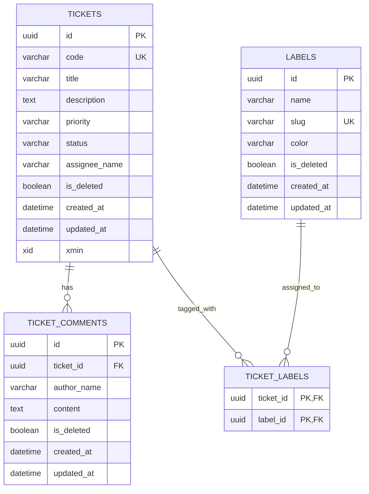

## Labels.Service

### Hàm: GetLabels(CancellationToken ct)

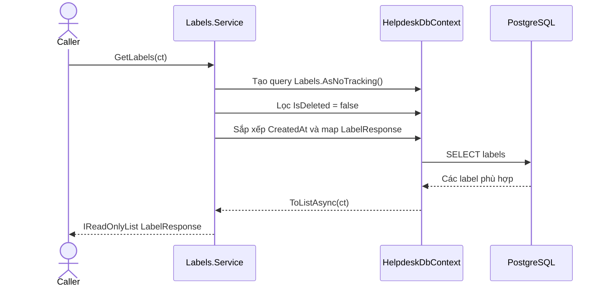

### Hàm: CreateLabel(CreateLabelRequest request, CancellationToken ct)

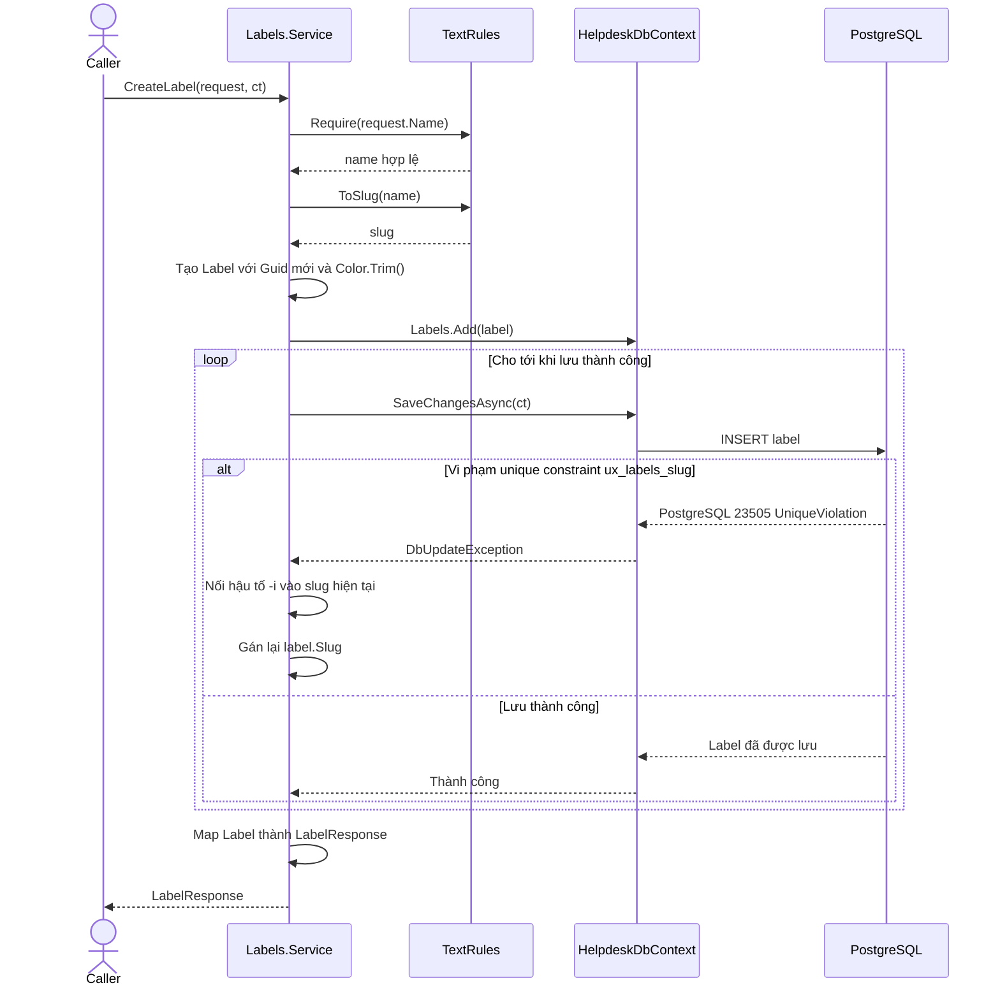

### Hàm: DeleteLabels(List&lt;Guid&gt; labelIds, CancellationToken ct)

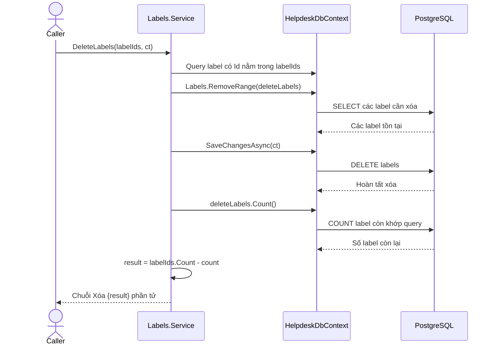

## Tickets.Service

### Hàm: CreateTicket(CreateTicketRequest request, CancellationToken ct)

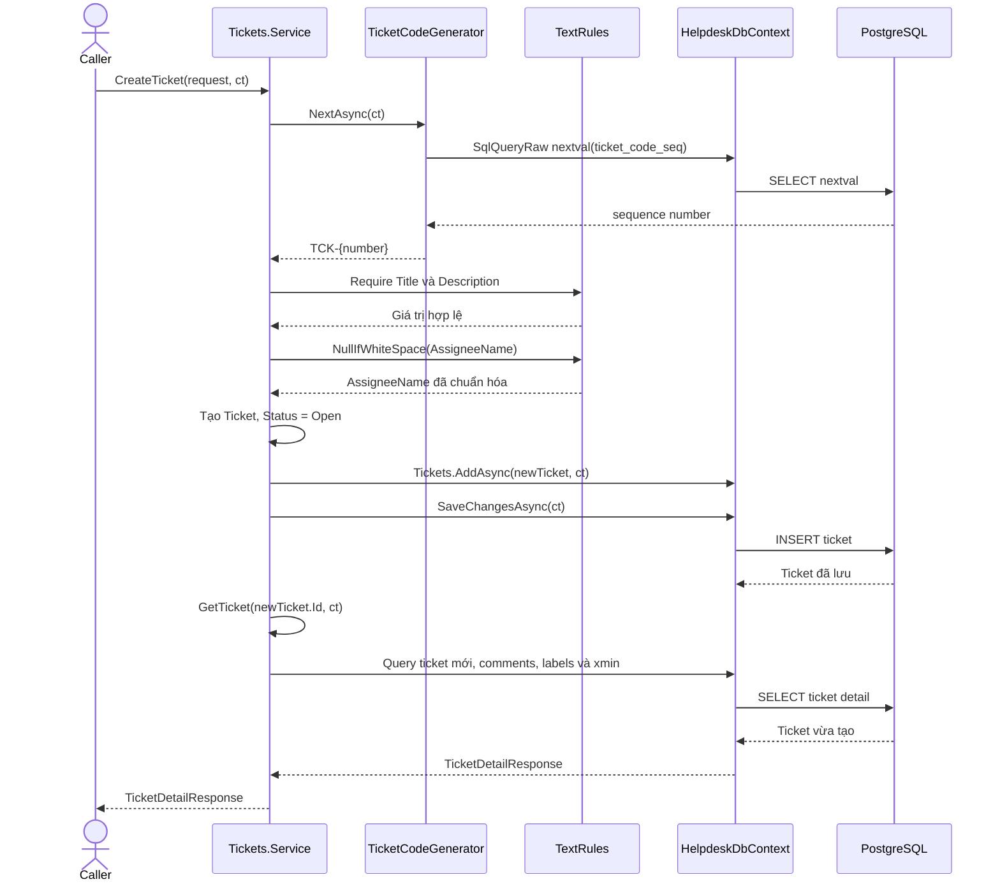

### Hàm: GetTicket(Guid id, CancellationToken ct)

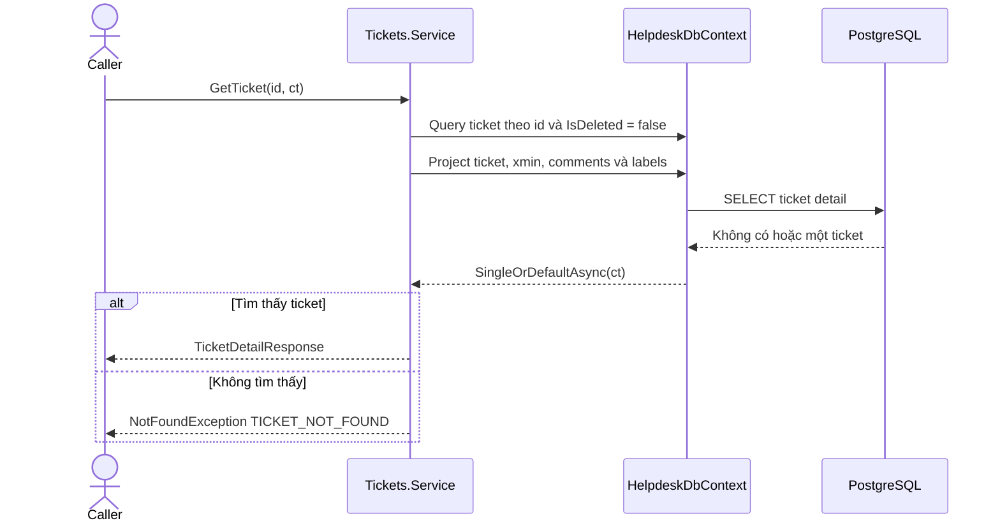

### Hàm: GetTickets(TicketFilter filter, CancellationToken ct)

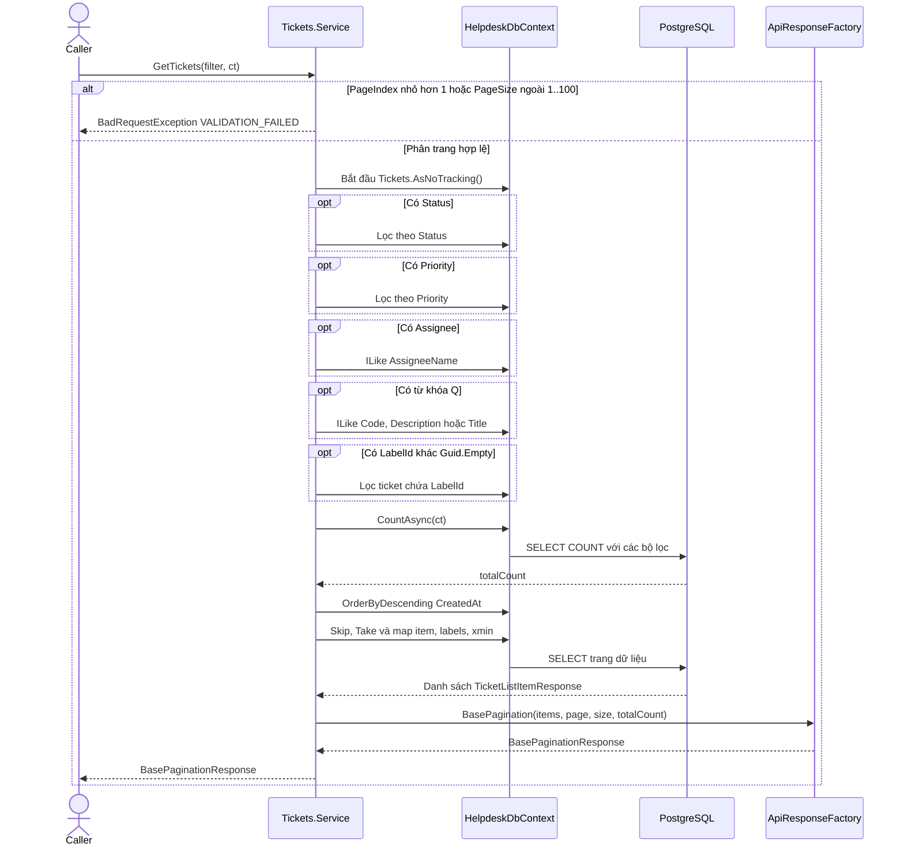

### Hàm: UpdateTicket(Guid id, UpdateTicketRequest request, CancellationToken ct)

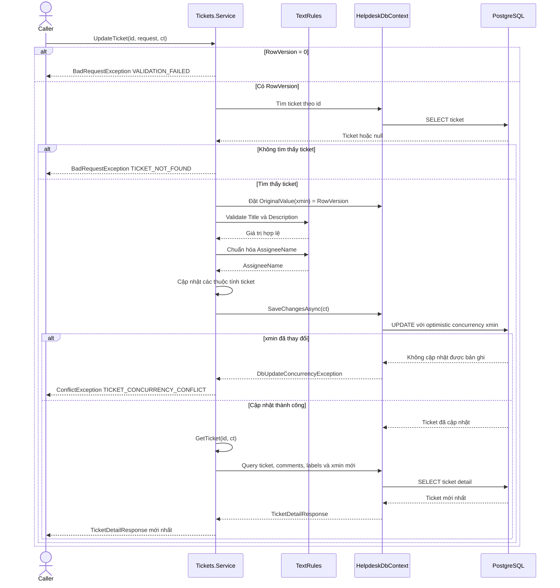

### Hàm: AddCommentTicket(Guid ticketId, AddCommentRequest request, CancellationToken ct)

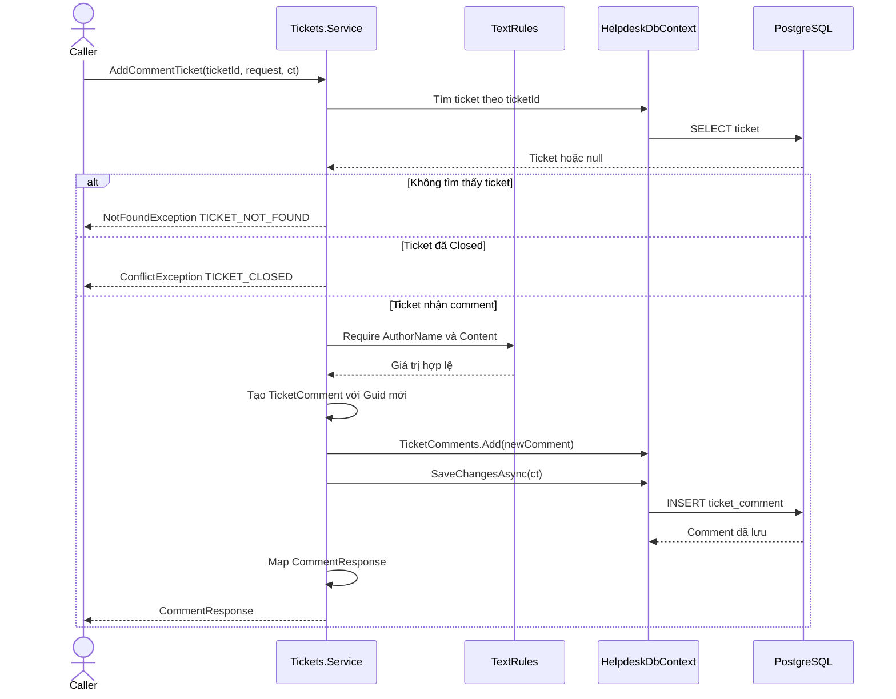

### Hàm: ReplaceLabelsTicket(Guid ticketId, ReplaceTicketLabelsRequest request, CancellationToken ct)

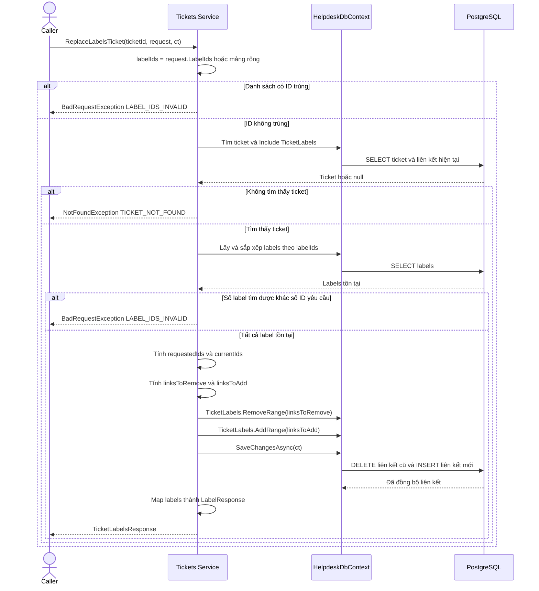

### Hàm: DeleteTicket(Guid id, CancellationToken ct)

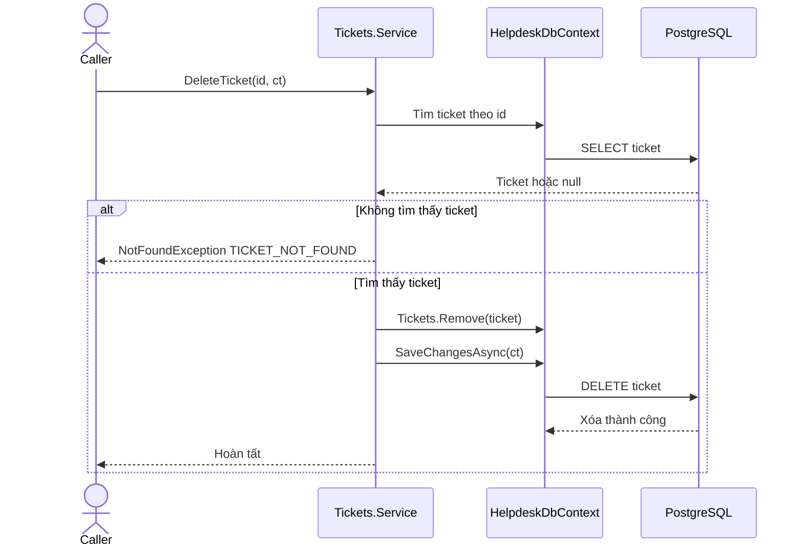
